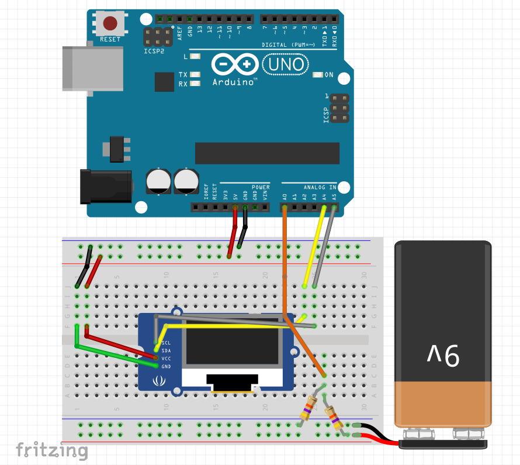

# Overview
This code reads the voltage off of analog pin zero (A0) on an Arduino and displays it to an oled.

## How it works
I'll document this more, perhaps. For now, look at the code.

## Circuit
See this Fritzing diagram:

The voltage divider is a 47k connected to the positive rail of the supply to be measured, and a 22k connected to the negative side.  There's one wire with a positive voltage going to the input pin, and the ground is already shared with the power supply being measured.

I calculated the maximum voltage this can measure to be 15.682.  This is because the top limit the Arduino can measure is 5v. So when the voltage is at 15.682, the voltage divider divides it down to 15.682.  Of course, there are variances in resistors.  After measuring the voltage with a multimeter, I adjusted the number slightly in the code.

## Other info
Here's all the deets on the Adafruit GFX lib that writes text to the display:
https://learn.adafruit.com/adafruit-gfx-graphics-library/graphics-primitives

The guide I used for the display setup:
https://randomnerdtutorials.com/guide-for-oled-display-with-arduino/

Voltage divider calculator:
http://www.ohmslawcalculator.com/voltage-divider-calculator

oled:
https://www.ebay.com/itm/0-96-I2C-IIC-Serial-128-64-Blue-white-OLED-LCD-LED-Display-Module-for-Arduino/273156460316